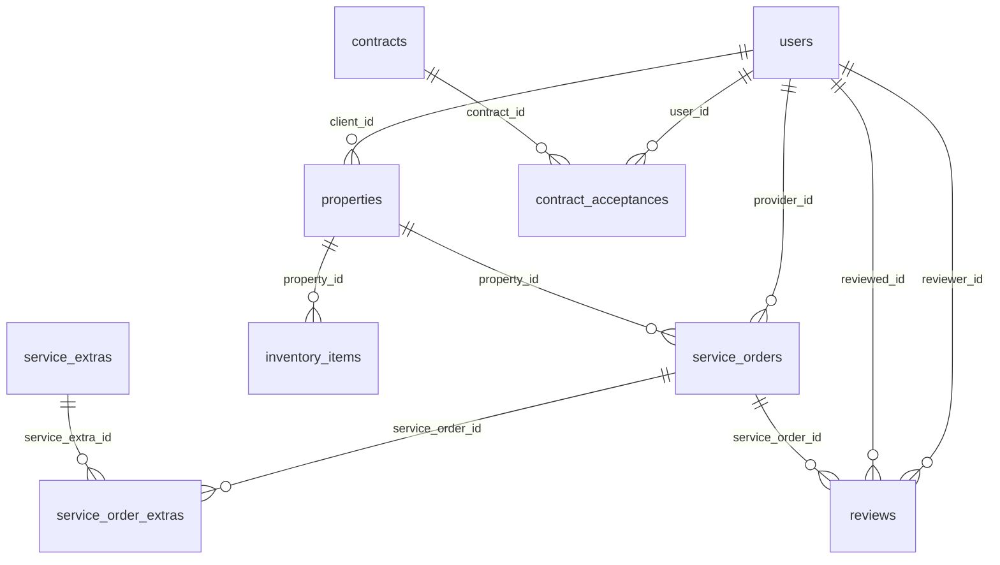

# Arquitetura de Dados — EB Services API

Relatório técnico do schema PostgreSQL de produção. Todas as tabelas usam **UUID v4** como PK, **snake_case** no banco, **timestamps** (`created_at`, `updated_at`) e enums para estados fixos.

## Diagrama de relacionamentos



## Tabelas

### 1. `users`

Identidade e autenticação dos três pilares (admin, client, provider).

| Campo | Tipo | Descrição |
|-------|------|-----------|
| `id` | UUID | PK |
| `name` | VARCHAR(150) | Nome completo |
| `email` | VARCHAR(255) | E-mail único |
| `password_hash` | VARCHAR(255) | Hash bcrypt |
| `role` | ENUM | `admin`, `client`, `provider` |
| `phone` | VARCHAR(30) | Telefone |
| `locale` | ENUM | `pt`, `en` — preferência multi-idioma |
| `avatar_url` | VARCHAR(2048) | URL do avatar |
| `active` | BOOLEAN | Conta ativa (login permitido) |
| `last_login_at` | TIMESTAMP | Último login |
| `created_at` / `updated_at` | TIMESTAMP | Auditoria |

**Relacionamentos:** 1:N → `properties`, `service_orders` (como provider), `contract_acceptances`, `reviews` (como reviewer e reviewed).

---

### 2. `properties`

Propriedades atendidas (Airbnb, residencial, comercial).

| Campo | Tipo | Descrição |
|-------|------|-----------|
| `id` | UUID | PK |
| `name` | VARCHAR(200) | Nome |
| `address` | VARCHAR(500) | Endereço |
| `description` | TEXT | Descrição |
| `ical_url` | VARCHAR(2048) | Link iCal (Airbnb) |
| `client_id` | UUID | FK → `users.id` (role client) |
| `status` | ENUM | `active`, `inactive` |
| `metadata` | JSONB | Configurações específicas da casa |
| `created_at` / `updated_at` | TIMESTAMP | Auditoria |

**Relacionamentos:** N:1 → `users`; 1:N → `service_orders`, `inventory_items`.

**Offline / i18n:** `metadata` JSONB armazena configs extensíveis sem migration; textos de UI ficam no app via `users.locale`.

---

### 3. `service_extras`

Catálogo mestre de serviços adicionais.

| Campo | Tipo | Descrição |
|-------|------|-----------|
| `id` | UUID | PK |
| `name` | VARCHAR(200) | Ex.: "Limpeza de Geladeira" |
| `default_price` | DECIMAL(10,2) | Preço padrão |
| `estimated_time` | INTEGER | Tempo estimado (minutos) |
| `created_at` / `updated_at` | TIMESTAMP | Auditoria |

**Relacionamentos:** 1:N → `service_order_extras`.

---

### 4. `service_orders`

Ordens de serviço — núcleo operacional (GPS, fotos, financeiro).

| Campo | Tipo | Descrição |
|-------|------|-----------|
| `id` | UUID | PK |
| `property_id` | UUID | FK → `properties.id` |
| `provider_id` | UUID | FK → `users.id` (nullable até atribuição) |
| `status` | ENUM | `pending`, `in_progress`, `completed`, `canceled`, `billed` |
| `scheduled_date` | DATE | Data agendada (ex.: checkout iCal) |
| `started_at` | TIMESTAMP | Início da execução |
| `finished_at` | TIMESTAMP | Fim da execução |
| `checkin_lat` / `checkin_long` | DECIMAL(10,7) | GPS check-in |
| `checkout_lat` / `checkout_long` | DECIMAL(10,7) | GPS check-out |
| `before_photos` | JSONB | Array de URLs/objetos de foto (antes) |
| `after_photos` | JSONB | Array de URLs/objetos de foto (depois) |
| `base_price` | DECIMAL(10,2) | Preço base |
| `extras_total_price` | DECIMAL(10,2) | Soma dos extras |
| `total_price` | DECIMAL(10,2) | Total cobrado |
| `created_at` / `updated_at` | TIMESTAMP | Auditoria / sync offline |

**Constraints:** UNIQUE (`property_id`, `scheduled_date`) — evita duplicidade em sync iCal.

**Relacionamentos:** N:1 → `properties`, `users` (provider); 1:N → `service_order_extras`, `reviews`.

**Offline:** GPS, fotos (JSONB) e timestamps permitem sync incremental pelo app mobile (`updated_at` como cursor).

---

### 5. `service_order_extras`

Pivot OS ↔ Extra com preço congelado no momento da cobrança.

| Campo | Tipo | Descrição |
|-------|------|-----------|
| `id` | UUID | PK |
| `service_order_id` | UUID | FK → `service_orders.id` |
| `service_extra_id` | UUID | FK → `service_extras.id` |
| `price_at_time` | DECIMAL(10,2) | Valor cobrado na hora |
| `created_at` / `updated_at` | TIMESTAMP | Auditoria |

**Constraints:** UNIQUE (`service_order_id`, `service_extra_id`).

---

### 6. `inventory_items`

Estoque de insumos por propriedade.

| Campo | Tipo | Descrição |
|-------|------|-----------|
| `id` | UUID | PK |
| `property_id` | UUID | FK → `properties.id` |
| `name` | VARCHAR(200) | Nome do item |
| `current_quantity` | DECIMAL(10,2) | Quantidade atual |
| `critical_level` | DECIMAL(10,2) | Nível crítico (alerta) |
| `unit` | ENUM | `unidade`, `rolo`, `litro` |
| `created_at` / `updated_at` | TIMESTAMP | Auditoria |

**Constraints:** UNIQUE (`property_id`, `name`).

**Relacionamentos:** N:1 → `properties`.

---

### 7. `contracts`

Modelos de contrato versionados.

| Campo | Tipo | Descrição |
|-------|------|-----------|
| `id` | UUID | PK |
| `title` | VARCHAR(300) | Título |
| `content` | TEXT | Conteúdo HTML/texto |
| `type` | ENUM | `client_eb`, `provider_eb` |
| `version` | INTEGER | Versão do documento |
| `created_at` / `updated_at` | TIMESTAMP | Auditoria |

**Constraints:** UNIQUE (`type`, `version`).

**Relacionamentos:** 1:N → `contract_acceptances`.

---

### 8. `contract_acceptances`

Log legal de aceite digital.

| Campo | Tipo | Descrição |
|-------|------|-----------|
| `id` | UUID | PK |
| `user_id` | UUID | FK → `users.id` |
| `contract_id` | UUID | FK → `contracts.id` |
| `accepted_at` | TIMESTAMP | Momento do aceite |
| `ip_address` | VARCHAR(45) | IP (IPv4/IPv6) |
| `user_agent` | VARCHAR(512) | User-Agent do browser/app |
| `created_at` / `updated_at` | TIMESTAMP | Auditoria |

**Constraints:** UNIQUE (`user_id`, `contract_id`).

---

### 9. `reviews`

Avaliações pós-serviço.

| Campo | Tipo | Descrição |
|-------|------|-----------|
| `id` | UUID | PK |
| `service_order_id` | UUID | FK → `service_orders.id` |
| `reviewer_id` | UUID | FK → `users.id` (quem avalia) |
| `reviewed_id` | UUID | FK → `users.id` (quem é avaliado) |
| `rating` | INTEGER | 1–5 (CHECK constraint) |
| `comment` | TEXT | Comentário opcional |
| `created_at` / `updated_at` | TIMESTAMP | Auditoria |

**Constraints:** UNIQUE (`service_order_id`, `reviewer_id`); CHECK `rating BETWEEN 1 AND 5`.

---

## Ordem das migrations

| # | Arquivo | Dependência |
|---|---------|-------------|
| 1 | `20260520000001-create-users.js` | — |
| 2 | `20260520000002-create-properties.js` | users |
| 3 | `20260520000003-create-service-extras.js` | — |
| 4 | `20260520000004-create-service-orders.js` | users, properties |
| 5 | `20260520000005-create-service-order-extras.js` | service_orders, service_extras |
| 6 | `20260520000006-create-inventory-items.js` | properties |
| 7 | `20260520000007-create-contracts.js` | — |
| 8 | `20260520000008-create-contract-acceptances.js` | users, contracts |
| 9 | `20260520000009-create-reviews.js` | service_orders, users |

## Models Sequelize

Todos em `src/models/`:

- `User.js`, `Property.js`, `ServiceOrder.js`, `ServiceExtra.js`
- `ServiceOrderExtra.js`, `InventoryItem.js`, `Contract.js`
- `ContractAcceptance.js`, `Review.js`

Associações centralizadas em `src/models/index.js`.

## Enums (constants)

Definidos em `src/config/constants.js`:

| Constante | Valores |
|-----------|---------|
| `USER_ROLES` | admin, client, provider |
| `PROPERTY_STATUSES` | active, inactive |
| `SERVICE_ORDER_STATUSES` | pending, in_progress, completed, canceled, billed |
| `INVENTORY_UNITS` | unidade, rolo, litro |
| `CONTRACT_TYPES` | client_eb, provider_eb |
| `SUPPORTED_LOCALES` | pt, en |

## Suporte a operação offline

| Mecanismo | Uso |
|-----------|-----|
| `updated_at` em todas as tabelas | Cursor de sync incremental |
| `before_photos` / `after_photos` JSONB | Queue de fotos no app, merge no sync |
| GPS DECIMAL nullable | Preenchidos no check-in/out offline |
| `metadata` JSONB em properties | Configs locais sem alterar schema |
| UNIQUE constraints | Idempotência em sync iCal e aceites |

## Aplicar schema

```bash
# Banco limpo (desenvolvimento)
npm run migrate

# Seed admin
npm run seed
```

> Se já existia schema anterior, faça drop/recreate do banco de desenvolvimento antes de migrar — as migrations foram consolidadas para o schema final.
